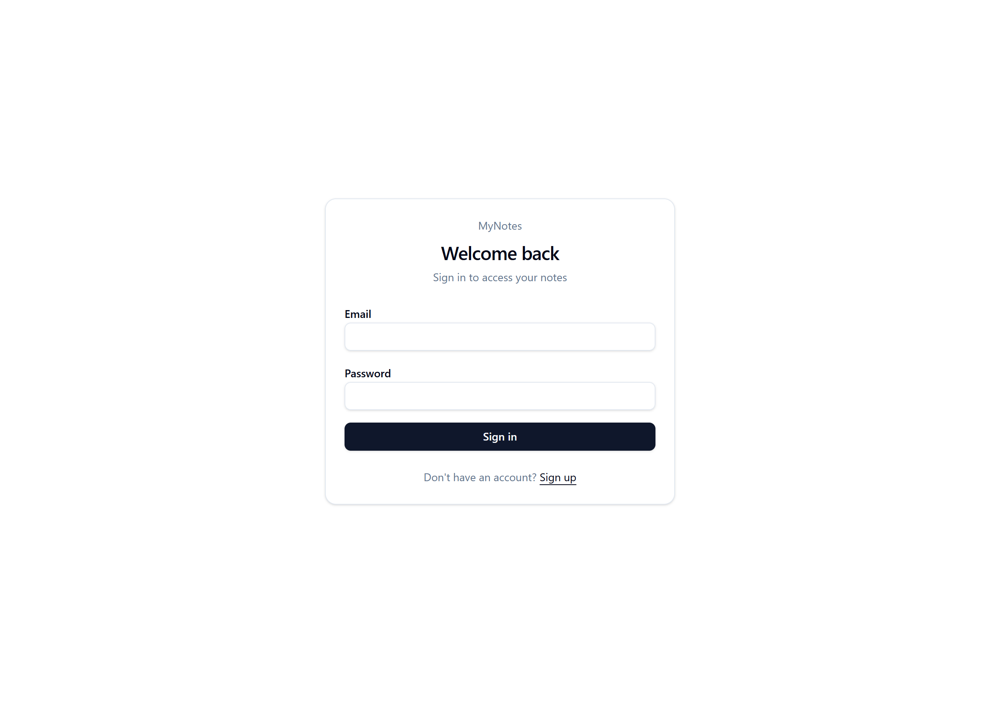
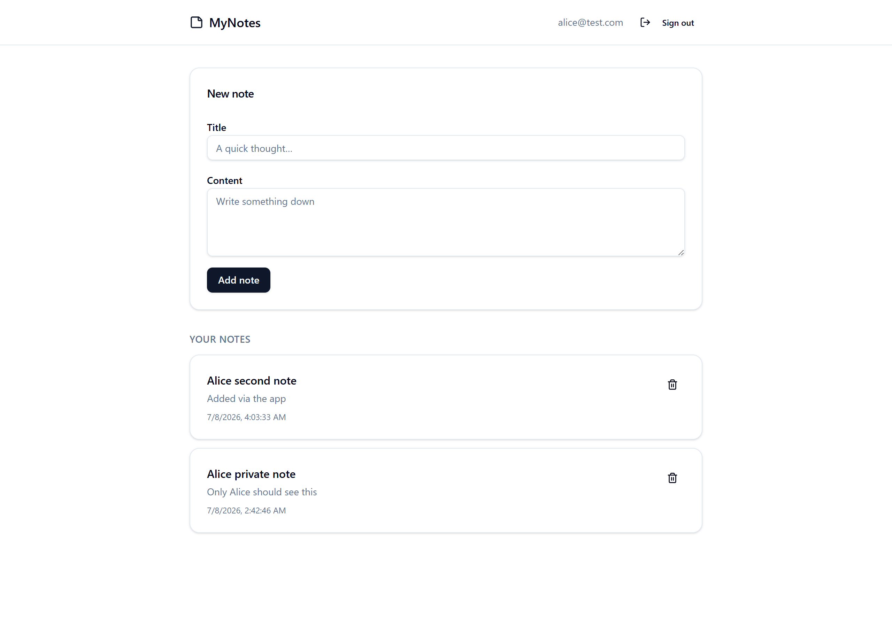

# MyNotes — Secure Multi-User Notes App

A small full-stack notes app where every user signs in and sees **only their own notes** — enforced at the database level with PostgreSQL Row Level Security (RLS), not just hidden in the frontend.

Built as a portfolio piece to demonstrate a real production workflow: an AI-generated frontend wired to a hand-secured backend, then debugged and hardened by hand.

## Screenshots

| Sign in | Your notes (logged in as one user) |
| --- | --- |
|  |  |

Each user only ever sees their own notes — the list on the right belongs to the logged-in account and contains no other user's data.

## What it does

- Email / password authentication (sign up + log in)
- Each logged-in user has a private list of notes
- Create and delete notes
- Protected routes — you must be logged in to reach your notes
- **True data isolation:** User A can never read, edit, or delete User B's notes, even if the frontend or API is tampered with

## Tech stack

| Layer | Technology |
| --- | --- |
| Frontend | React + TypeScript, TanStack Start/Router, Tailwind CSS, shadcn/ui |
| Backend | Supabase (PostgreSQL, Auth, auto-generated API) |
| Security | PostgreSQL Row Level Security (RLS) policies |
| Tooling | Vite, generated with Lovable, refined by hand |

## The part that matters: Row Level Security

Every user's notes live in the same `notes` table. What stops one user from reading another's rows? RLS — rules enforced by the database itself. The `notes` table has RLS enabled and four policies, one per operation:

```sql
-- Read: only rows you own
create policy "Users can view their own notes"
  on public.notes for select
  using (auth.uid() = user_id);

-- Create: you can only create notes stamped with your own id
create policy "Users can insert their own notes"
  on public.notes for insert
  with check (auth.uid() = user_id);

-- Update: only your rows, and you can't reassign ownership
create policy "Users can update their own notes"
  on public.notes for update
  using (auth.uid() = user_id)
  with check (auth.uid() = user_id);

-- Delete: only your rows
create policy "Users can delete their own notes"
  on public.notes for delete
  using (auth.uid() = user_id);
```

`auth.uid()` returns the id of the user making the request. `auth.uid() = user_id` means "only touch rows this user owns." Because it runs in the database, the protection holds even if the client code is careless — which is exactly how data leaks are prevented.

### Table schema

```sql
create table public.notes (
  id         uuid        primary key default gen_random_uuid(),
  user_id    uuid        not null references auth.users (id) on delete cascade,
  title      text        not null,
  content    text,
  created_at timestamptz not null default now()
);
```

## Proven, not assumed

Isolation was verified two ways:

1. **In SQL** — by impersonating each user (`set local role authenticated` + a forged JWT claim) and confirming each `select * from notes` returned only that user's rows. A user attempting to insert a note owned by someone else was rejected by the policy.
2. **In the running app** — logged in as User A (sees only A's notes, can add new ones), signed out, logged in as User B (sees only B's notes). No cross-user data ever appears.

## A real bug, debugged by hand

The generated insert code relied on a database default to fill in `user_id` and left it out of the payload. That default wasn't in effect, so `user_id` came through as `NULL` and every insert was rejected by the RLS policy (`new row violates row-level security policy`).

Fix: stamp the note with the authenticated user's id explicitly, taken from the session — so inserts satisfy the policy regardless of table defaults.

```ts
const payload = {
  title: title.trim(),
  content: content.trim() || null,
  user_id: user.id, // from the logged-in session
};
await supabase.from("notes").insert(payload);
```

This is the workflow the whole project demonstrates: generate fast with AI, then read, verify, and fix the parts that have to be correct.

## Running locally

```bash
npm install
npm run dev
```

Set the following environment variables (in a `.env` file) to point at your own Supabase project:

```
VITE_SUPABASE_URL=your-project-url
VITE_SUPABASE_PUBLISHABLE_KEY=your-publishable-key
```

Then apply the SQL above (table + RLS policies) in the Supabase SQL Editor.

---

Built by [Faizul](https://github.com/faizul666) as part of a hands-on ramp into AI-assisted SaaS development.
